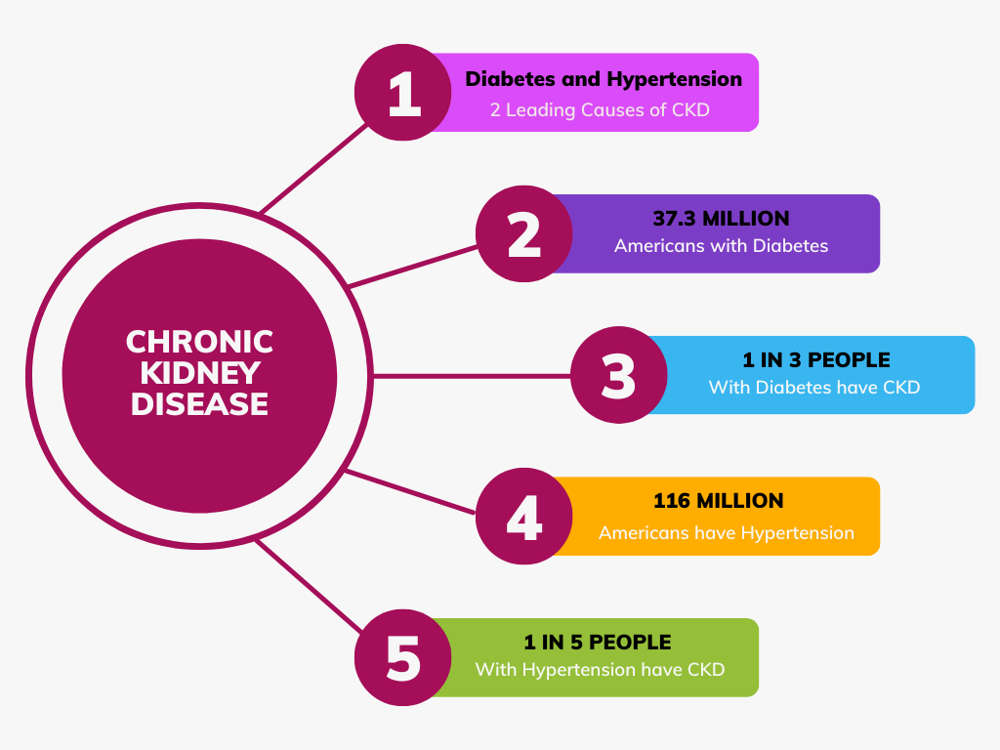

## Chronic Kidney Disease Prevalence and Awareness EDA

### Objective:

Data shows that Chronic Kidney Disease (CKD) is on the rise and affects 1 out 3 adults with diabetes and 1 out of 5 adults with high blood pressure (Chronic Kidney Disease (CKD) Surveillance System, n.d.-b). But CKD doesn’t seem to have the same kind of wide-spread attention as diabetes and high blood pressure. With the progression of CKD comes worsening health problems that go beyond those of just diabetes and heart disease. The CDC claims that heart disease is the leading cause of death for people aged 45 and older (Heart Disease | cdc.gov, 2022). Therefore, the Chronic Kidney Disease Prevalence and Awareness EDA project atttempts to answer the following:

* Should Chronic Kidney Disease (CKD) be considered a major leading caus of death considering the population increase in diabetes and hypertension which themselves are the 2 leading contributors to CKD.
* What are the prevalence and awareness levels of CKD in the general population?
* What is the reason, if any, for the disparity between the prevalence level and awareness level?

### Results:

### Technical Specifications:
Files are:
* CKD_EDA_Briefing.pdf
* CKD_EDA_Report.pdf
* CKD_EDA_notebook.ipynb
* CKD_EDA_notebook.pdf

### References:

Chronic Kidney Disease (CKD) Surveillance System. (n.d.-b). https://nccd.cdc.gov/ckd/default.aspx
Heart Disease | cdc.gov. (2022, September 1). Centers for Disease Control and Prevention. https://www.cdc.gov/heartdisease/index.htm
