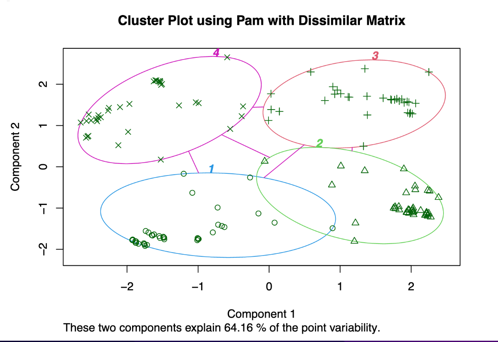

## Network Anomalous Event Correlation Using Clustering Methods

### Objective:

The main objective of this project is to determine the feasibility of detecting anomalous network traffic events using clustering methods.  Additionally,  using network diagram and Time-series anomaly detection methods are explored as as adjunct sub-projects. The dataset for this project contains a list of Source IPs, Destination IPs, the Event Time, and the Network Protocols.  The Source IPs and Destination IPs are ficticious and are non-attributable. Within the list of events are anomalous events identified by the network protocols and IP pair combinations. 

### Results:

Several clustering methods were selected. They include K-means, K-mediod, Hierarchical and DBScan.  The K-means and K-mediod produced the best results with similar 4 clusters.  The least effective clustering methods were the Hierarchical and the DBScan methods.  The network diagrams require the addition of the contextual data to be an effective method.  The Time-Series Anomaly Detection method requires the time intervals to be consistent throughout the dataset.  This is not a realistic possibility.  Additionally, when the time-intervals were adjusted to be consistent, the method did not identify any anamalous events.  

### Technical Specifications:

The code is written in R version 4.2.2.2 using the RStudio IDE version 2022.12.0 Build 353. The program loads several libraries to include ggplot2, tidyverse, iptools, factoextra, dbscan, fpc, anomalize, tidygraph, ggraph, cluter, anytime, tsibble, tibletime, network, and lubridate.    

### Files:

This repo contains 2 files. The Rscript in pdf format and as an Rscript file.

* [Net_Evt_Corr - Rscript in PDF format](./Net_Evt_Corr.pdf)
* [Net_Evt_Corr_code - Rscript](./Net_Evt_Corr_code.R)
