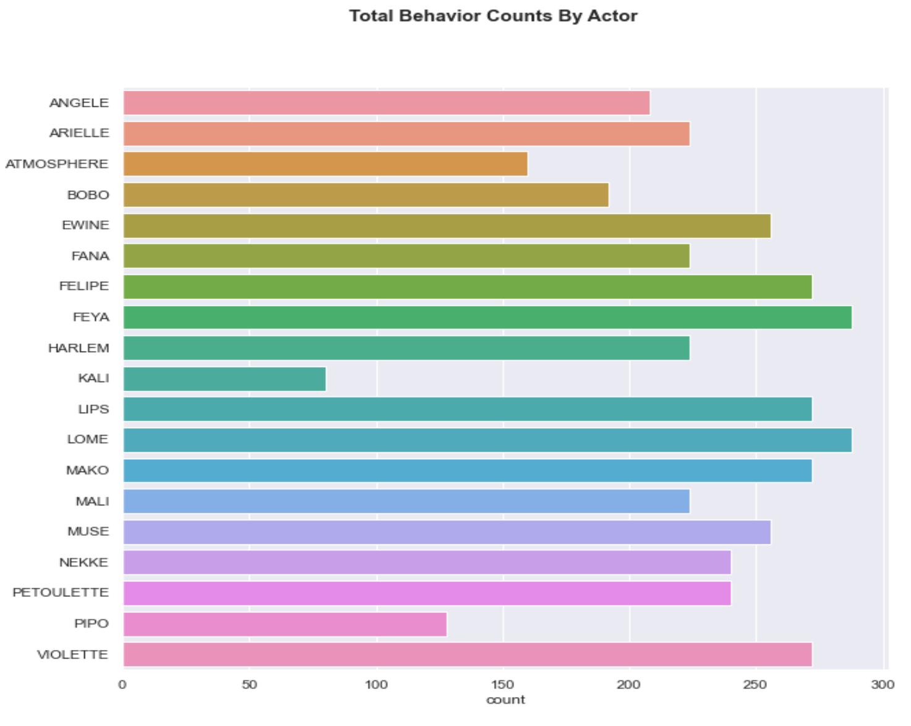

## Primate Prediction

### Objective:

The objective for the Primate Prediction project is to predict the Gender, Dominant Male, and Family groups within a group of primates.  The dataset for the project is from a study of social interactions amongst a group of 20 baboons at the Primate Center in France (Baboons’ Interactions - SocioPatterns.org, n.d.).  Each observation contains the the sender and reciever, the type of interation or behavior and the time of the event.  Basing the predictions on the behavior, the questions for the study are is it possible to:

* Predict the Gender.
* Predict the dominant male.
* Identify sub-groups.

The project uses network diagrams to identify sub-groups using the networkx library and the Kmodes clustering method.  Additionally, the dataset is reshaped to conduct exploratory analysis and as input into the Classification models. The Chi 2 and the Recursive Feature Elimination methods were chosen to refine the final dataset for the models. For the predictions, the project uses the Logistics Regression, Random Forest Classifier, and Ordinal Regression models.

### Results:

To predict the Gender based upon the behavior variables, the best results came from the Logistics Regression model with an accuracy score of 61%. The Dominant male test uses the Ordinal Regression Classifier model using the MORD library.  The MORD library supports the LogisticsIT, LogisticsAT, and the Ordinal Ridge algorithms. The project uses all three algorithms to predict the Dominant Male. The LogisticsAT model produced the best results with an F1-score of 71%. Looking at the results of this model run, the model did identify correctly the highest-ranking individual which is #7. The K-modes clustering method results show the 3 different clusters with the majority of the entities being assigned to one cluster.  This result is consistent with number of community results using the Girvan-Newman algorithm. A contributing factor to the mediocre results could be that the data did not contain enough variations within the features to serve as a good sample set for training. The dataset may contain a poor balance of bias and variance. Another reason is the imbalance of the gender observations within the dataset. This may have contributed to the underfitting of the models and not having enough observations to capture the underlying patterns within the data.     

### Technical Specifications:

The code is written in Python 3.8 and uses Jupyter Notebooks as the IDE.  The program uses Pandas and several libraries from Scikit-Learn, Matplotlib, Graphviz, and Networkx.  

### Files:

This repo contains 4 files. Primate_Predict_notebook is the notebook with the code. Primate_Predict_Report is a formal paper presenting the problem, the methods, the analysis, and the results of the project. The Primate_Predict_notebook.pdf is a PDF version of the Jupyter Notebook.

* [Primate_Predict_notebook - Notebook](./Primate_Predict_notebook.ipynb)
* [Primate_Predict_notebook - Notebook in PDF format](Primate_Predict_notebook.pdf)
* [Primate_Predict_report - Project Report in PDF format](./Primate_Predict_report.pdf)

### References:

Baboons’ interactions - SocioPatterns.org. (n.d.). (C) 2008-2011 SocioPatterns.org. http://www.sociopatterns.org/datasets/baboons-interactions
