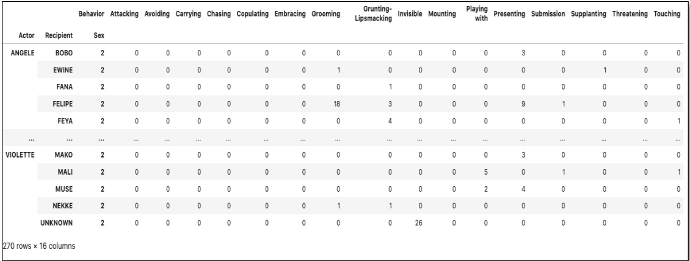

## Primate Prediction

### Objective:

The objective for the Primate Prediction project is to predict the Gender, Dominant Male, and Family groups within a group of primates.  The dataset for the project is from a study of social interactions amongst a group of 20 baboons at the Primate Center in France (Baboons’ Interactions « SocioPatterns.org, n.d.).  Each observation contains the the sender and reciever, the type of interation or behavior and the time of the event.  Basing the predictions on the behavior, the questions for the study are is it possible to:

* Predict the Gender.
* Predict the dominant male.
* Identify sub-groups.

The project uses network diagrams to identify sub-groups using the networkx library and the Kmodes clustering method.  Additionally, the dataset is reshaped to conduct exploratory analysis and as input into the Classification models. The Chi 2 and the Recursive Feature Elimination methods were chosen to refine the final dataset for the models. The project uses the Logistics Regression, Random Forest Classifier, and Ordinal Regression models for the predictions.

### Results:

### Technical Specifications:

### Files:

* Primate_Predict.ipynb
* Primate_Predict.pdf

### References:

Baboons’ interactions - SocioPatterns.org. (n.d.). (C) 2008-2011 SocioPatterns.org. http://www.sociopatterns.org/datasets/baboons-interactions
