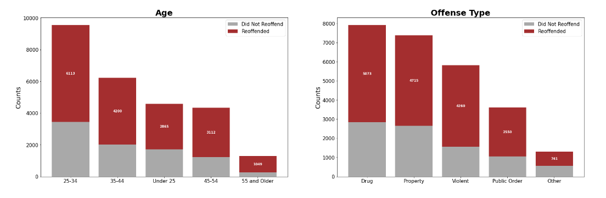

## Recidivism Prediction 

### Objective:

The objective of this project is to predict the likelihood of an individual to repeat crime otherwise known as recidivism.  In the United States, 67.8% of all convicts will reoffend within 3 years (Recidivism of Prisoners Released in 30 States in 2005: Patterns From 2005 to 2010 - Update, n.d.). The motiviation for the project is to identify a model most accurate to predict recidivism in determining parole decisions.  The models chosen for the predictions are the Random Forest Classifier, AdaBoost, and Naive Bayes models.  

### Results:

Methods of analysis include leveraging historical data, machine learning, and predictive modeling to determine the probability of a convict to reoffend. Multiple models were evaluated, and performance was measured using accuracy rates. The best performing model achieved an accuracy rate of 66%. This result is good, but the gravity of decisions made on personal freedoms and requires a higher accuracy to implement the model for use. It is recommended that further information is collected and aggregated into the current data set to increase model accuracy. 

### Technical Specifications:

The program is written in Python 3.8 and uses Jupyter Notebooks as the Interative Development Environment. The application uses The dataset is the 3-year Recidivism for Offenders Released from Prison from the Iowa Department of Corrections.  The data variables consist of offender demographics, offenses and the previoius recidivism reporting years.  The observations are data collected from 20010-2018 and contain 26,020 unique rows.

### Files:

The project files are listed below.  Recidivism_Predict.ipynb is the Notebook with the doe and the outputs.  The Recidivism_Predict_report.pdf is a report describing the Backgrounda nd Montivation for the project, a description of the methods and anaysis, and a discussion of the results with recommendations for further study.  Recid_Predict_Briefing.pdf is a copy of the Poer Point briefing slides.  Lastly the Recidivism_Predict_notebook.pdf is a copy of the Notebook in PDF format.

* [Recidivism_Predict_Notebook](./Recidivism_Predict.ipynb)
* [Recidivism_Predict_Report](./Recidivism_Predict_report.pdf)
* [Recidivism_Predict_Notebook PDF format](./Recidivism_Predict_notebook.pdf)
* [Recidivism_Predict_Briefing in PDF format](./Recid_Predict_Briefing.pdf)

### References:

Recidivism of Prisoners Released in 30 States in 2005: Patterns from 2005 to 2010 - Update. (n.d.). Bureau of Justice Statistics. https://bjs.ojp.gov/library/publications/recidivism-prisoners-released-30-states-2005-patterns-2005-2010-update
* 
