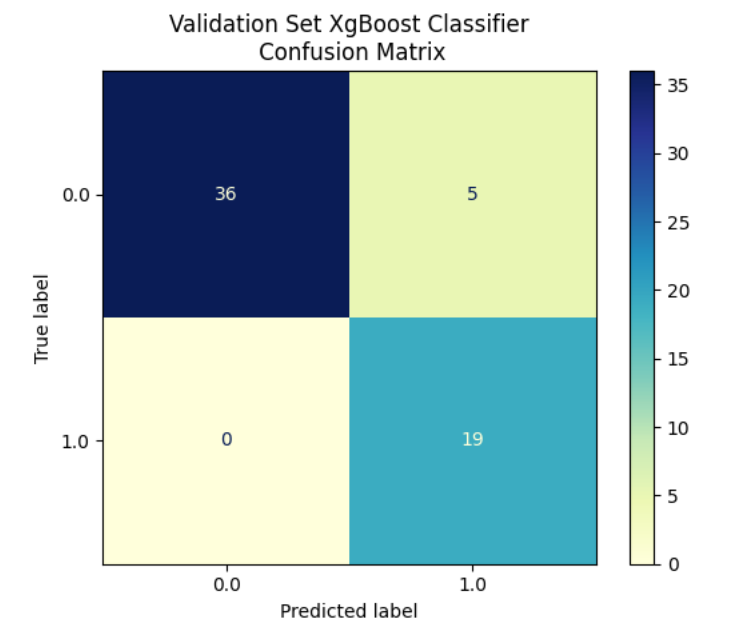

## Chronic Kidney Disease Prediction

### Objective:

The Chronic Kidney Disease (CKD) Prediction project attempts to predict the probability of an individual contracting CKD. Using three different models, the project uses a single dataset to compute the predictions and uses 2 additional datasets as a tertiary source for verifying the predictions. The 2 additional datasets contain only summary data, but the associated studies provide the detail with which to compare the model’s results. This dataset is from a study conducted by Dr. P. Soundarapandian. M.D., D.M, a Senior Consultant of Nephrology, Apollo Hospitals Tamilnau, India. The population for the study is 400 individuals in India who do or do not have CKD. The dataset is available from the University California Irvine Machine Learning Repository, (Dua and Graff, 2019).

### Results:

The Prediction project is a binary classification problem and uses 3 different models to predict a single outcome based upon a final set of 13 independent variables. The outcome or dependent variable indicates if an observation has or does not have CKD. The 3 models are a Random Forest Classifier, AdaBoost Classifier, and a XgBoost Classifier. Two feature selection models are used to derive the set of most suitable features. These are the RFE and the RFECV models, with the results from the RFCV being used as the final feature set.

Using the test and training sets, the 3 models produced accuracy scores close to each other. The overall accuracy score is 97%. A validation set is used as a secondary "unknown" data source.  Using this dataset, AdaBoost accuracy score dropped to 56.33%. Yet the same validation set is used for the Random Forest and XgBoost models. Using the validation set, Random Forest has an accuracy rate of 85% and the XgBoost model has an accuracy score of 93.33%. 

One explanation for the difference in the AdaBoost model’s test and validation predictions may be attributable to Overfitting. The AdaBoost algorithm is prone to Overfitting especially with a noisy dataset. The AdaBoost model was run twice and each time the accuracy rate using the test dataset stayed the same. Using the validation set the accuracy score decreased to 50%.

Out of the 3 models, XgBoost is the most accurate. It maintains accuracy across both the test and validation sets. The Random Forest Classifier is a possible contender, but the XgBoost model has much better accuracy rates. The AdaBoost model is prone to overfitting. Even with the application of some overfitting mitigations, the AdaBoost lags the XgBoost model in terms of performance. XgBoost model is much faster in execution and consumes less computer memory than the AdaBoost model.

### Technical Specifications:

The code is written in Python 3.8 and uses the Jupyter Notebook as the IDE.  It makes extensive use of the Pandas libraries for data cleaning and exploration.  In addition the code uses the SciKit-Learn libraries to build and fit the models.  The program uses Matplotlib and Seaborn to produce the graphs and plots.

### Files:

This repo contains 6 files.  The Jupyter Notebook contains the code and the output.  There is a pdf version of the code.  CKD_Predict_report.pdf is the project report detailing the background, analysis, and conclusion.  Lastly, CKD_Predict_Briefing.pdf is a PDF version of the Power Point briefing for the project. The primary dataset is ckd_data.csv and the validation dataset is val_set.csv. 

* [CKD_Predict_Briefing - briefing in PDF format](./CKD_Predict_Briefing.pdf)
* [CKD_Predict_report - report in PDF format](./CKD_Predict_report.pdf)
* [CKD_Predict_notebook - notebook in PDF format](./CKD_Predict_notebook.pdf)
* [CKD_Predict_notebook - Jupyter Notebook](./CKD_Predict_notebook.ipynb)
* [ckd_dataset - Primary dataset](./ckd_dataset.csv)
* [val_set - Validation dataset](./val_set.csv)

### References:

Dua, D. and Graff, C. (2019). UCI Machine Learning Repository [http://archive.ics.uci.edu/ml]. Irvine, CA: University of California, School of Information and Computer Science.
