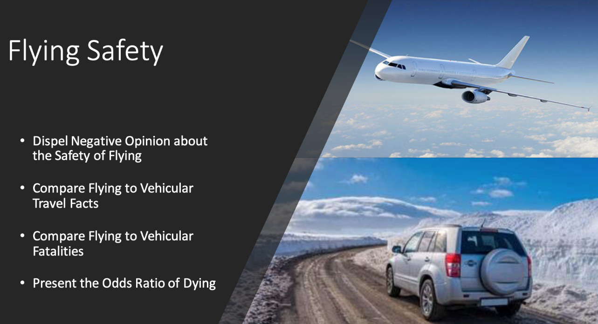

 ## Fly or Drive Project
 
 

### Objective:

The objective of this project is to convey to an audience that Airplane Travel is Safer than Vehicular Travel.  The analysis consists gathering data regarding airplane fatalities per year, vehicular fatalities per year, comparing miles flown versus miles traveled per year, and the numer of licensed drivers versus the number of airline passengers. From the data analysis, a comparative study of the differences between the two modes of travel are shown through charts and line graphs. The project contains two briefings. Air_Veh_Briefing iss intended for a general audience. The Air_Veh_Exec is an Executive level briefing which includes additional graphs and metrics than the general audience briefing.

### Results:

Based on the resulsts of the comparative study, Airline Travel is much safer than Vehicular Travel.  On average, from 2009 - 2020 there was 1 per year domestic airline fatality as compared to 35,206 fatalities per year for vehicular travel.  The odds of dying in a motor vehicle accident is 1:107 as compared to airline travel were the amount is less than zero (National Safety Council. n.d.).  

### Technical Specifications:

The project uses Microsoft Power BI to import the data and create the charts and plots. 

### Files:

There are 2 files in this rep and both are PDF versions of Power Point briefing presentations

* [Air_Veh_Briefing - Power Point briefing in PDF format](./Air_Veh_Briefing.pdf)
* [Air_Veh_Ex_Briefing - Power Point briefing in PDF format](./Air_Veh_Ex_Briefing.pdf)

### References:

National Safety Council. (n.d.). Odds of Dying - National Safety Council. Retrieved November 17, 2021, from https://www.nsc.org/community- s afety/res ources /odds -of-dying
