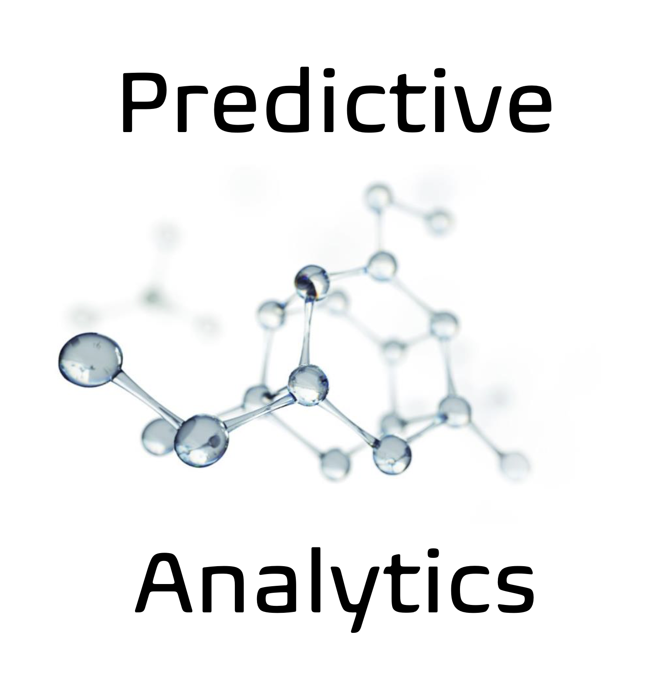

## Predictive Analytics: HealthCare Benefits and Consequences 

### Objective:

The purpose for this project is to present a review of the role of Predictive Analytics in three of the top deadliest diseases afflicting Americans today. These are Cancer, Alzheimer’s, and Heart Diseases. The objectives of the review are to ascertain the positive impacts and contributions to combating these diseases. Another objective is to identify ethical and privacy issues with the early diagnosis or the prediction of outcome from the diseases. With Electronic Health Records (EHR) being the norm, the likelihood of inadvertent disclosure of this data will happen. What are the ramifications for disclosing the results from Predictive Analytics recorded in EHR?

### Results:

The review consists of a literature review of several published studies addressing the use of Predictive Analytics in advancing disease diagnosis and progression. An example of this is the study of predicting cardivascular disease using the Support Vector Machine (SVM), Naïve-Bayes, Multi-layer Perceptron (MLP), RF, AdaBoost boosted Trees, and Binary Discriminants algorithms. The results of this study show that Naïve Bayes provides more accurate results, followed by AdaBoost model.

Other sources were reviewed that addressed the Legal and Ethical implication of Predictive Analytics. TThe study found that there are significant ethical and privacy issues when it comes to predicting the propensity for acquiring a fatal disease. The creators and consumers of PA data need to be aware of the Privacy, Ethical, and Security issues concerning the protection and processing of sensitive data. They must be knowledgeable of the Health Insurance Portability and Accountability Act (HIPAA), Personally Identifiable Information (PII), and other Privacy requirements. The collection and processing of data is largely unregulated in the United States except for specific segments such as healthcare and payment card processing. Additionally, medical researchers need to be aware of the sensitivity of the predictions and outcomes.

### Technical Specifications:  N/A

### Files:

This repo containsone file which is the final report in PDF format.

* [Pred_Analytics_Report](./Pred_Analytics_Report.pdf)
